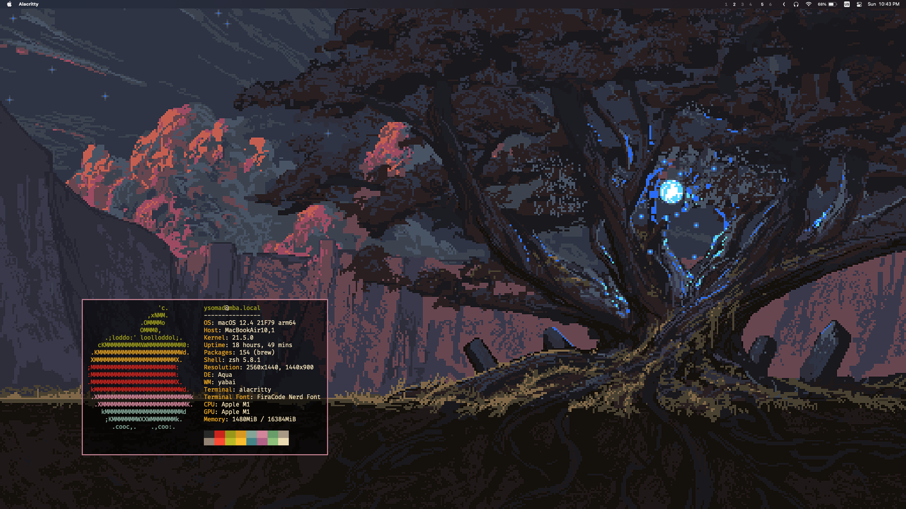

# Dotfiles



## Install configuration and package manager

1. Clone repository
```sh
git clone git@github.com:ysomad/dotfiles.git
```

2. Go to dotfiles directory
```sh
cd /path/to/dotfiles
```

3. Install package manager and packages which is not installable with it
```sh
./bootstrap.sh
```

4. Install symlinks for config files
```sh
./install
```

## MacOS

1. Install packages from Brewfile
```sh
brew bundle && brew doctor && brew cleanup
```

2. Set macOS sensible defaults
```sh
sudo chmod 755 ./.macos
./.macos
```

### Yabai
[Disable system integrity protection](https://github.com/koekeishiya/yabai/wiki/Disabling-System-Integrity-Protection)

## NeoVim
1. Install Gopls server (cannot be installed in bootstrap since `Go` is dependency in `Brewfile`)
```sh
go install golang.org/x/tools/gopls@latest
```

2. Open nvim and run `:PackerSync` to install plugins.
3. To install Go dependencies run in nvim `:GoInstallDeps`

## Tmux
- Open tmux session and press `Ctrl-a + I` to install tmux plugins

## TODO
### Nvim
https://github.com/antgubarev/dotfiles/blob/master/nvim/init.vim
1. Configure Git integration
2. Configure debugger ('mfussenegger/nvim-dap', 'leoluz/nvim-dap-go', 'rcarriga/nvim-dap-ui')
3. Configure Go test integrations ('nvim-neotest/neotest', 'nvim-neotest/neotest-go')
